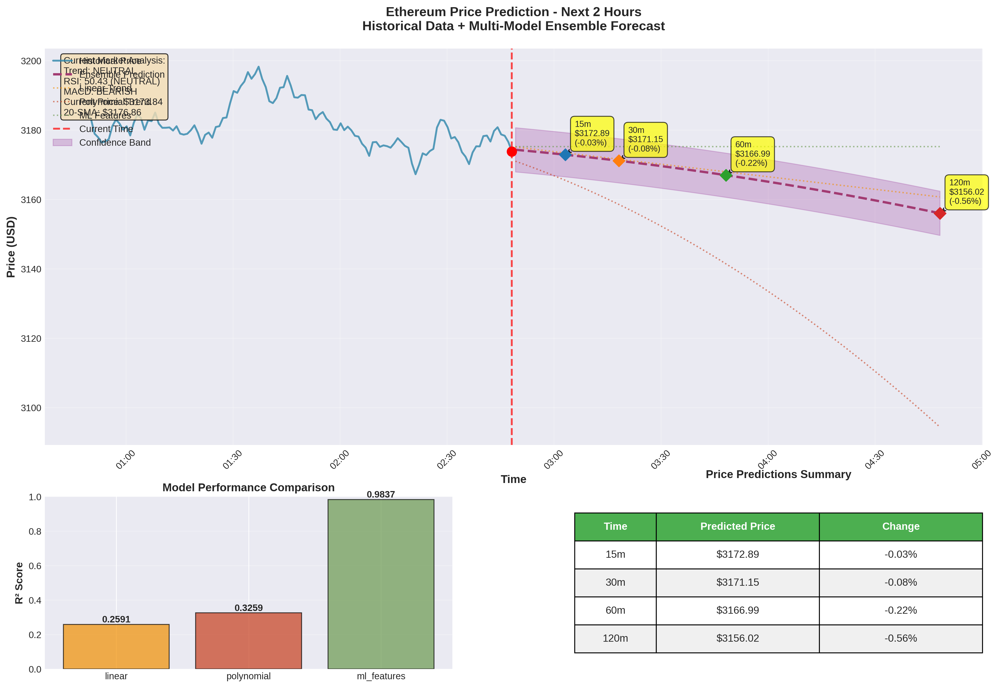

# Ethereum Price Prediction Report

**Generated:** 2026-01-05 07:54:47 UTC  
**Current Price:** $3173.84

---

## Executive Summary

### Trading Signal: WAIT

**Action:** No clear signal - wait for better setup  
**Confidence:** LOW  
**Market Trend:** NEUTRAL

### Market Metrics

| Metric | Value |
|:-------|:------|
| **Current Price** | $3173.84 |
| **Trend** | NEUTRAL |
| **RSI (14)** | 50.43 (NEUTRAL) |
| **MACD** | BEARISH |
| **BB Position** | MIDDLE |

---

## Price Predictions

| Time Horizon | Predicted Price | Change | Target Time |
|:-------------|:----------------|:-------|:------------|
| **15m** | $3172.89 | -0.03% | 2026-01-05T03:03:11.185768 |
| **30m** | $3171.15 | -0.08% | 2026-01-05T03:18:11.185768 |
| **60m** | $3166.99 | -0.22% | 2026-01-05T03:48:11.185768 |
| **120m** | $3156.02 | -0.56% | 2026-01-05T04:48:11.185768 |

---

## Trading Analysis

### Market Trend Assessment

**Overall Trend:** NEUTRAL (Confidence: LOW)

**Trend Components:**
- Moving Average Alignment: Bearish
- Price Action: Bullish
- Momentum: Neutral
- RSI: 50.43
- MACD: Bearish

### Support and Resistance Levels

**Current Price:** $3173.84

**Resistance Levels:**
- R1: $3184.64 (+0.34%)

**Support Levels:**
- S1: $3171.10 (-0.09%)

### Trading Signal

**Signal:** WAIT  
**Action:** No clear signal - wait for better setup  
**Confidence:** LOW

**Analysis Reasoning:**

- Market trend: NEUTRAL
- RSI neutral at 50.4
- MACD bearish crossover
- Price near lower Bollinger Band
- Support at $3171.10 (0.1% below)
- Resistance at $3184.64 (0.3% above)

**Signal Strength Scores:**

- Buy Score: 2
- Sell Score: 4
- Short Score: 2

---

## Prediction Charts

### Overview Chart

Complete view of historical data, predictions from all models, and ensemble forecast with confidence intervals.

### 1-Hour Focused Prediction

Detailed near-term view with trend lines and prediction paths.

### Technical Indicators

Comprehensive analysis of all technical indicators.

---

## Model Performance

| Model | R² Score | Ensemble Weight | Status |
|:------|:---------|:----------------|:-------|
| Linear | 0.2591 | 16.5% | Fair |
| Polynomial | 0.3259 | 20.8% | Fair |
| Ml Features | 0.9837 | 62.7% | Excellent |

**Ensemble R² Score:** N/A  
**Prediction Confidence:** High

---

## Terminology Guide

Understanding the technical terms used in this report:

### RSI

**Description:** A momentum indicator that measures the speed and magnitude of price changes. Values range from 0-100.

**Interpretation:** Above 70 = Overbought (price may fall), Below 30 = Oversold (price may rise), 40-60 = Neutral

### MACD

**Description:** A trend-following indicator that shows the relationship between two moving averages of price.

**Interpretation:** Bullish = Upward trend likely, Bearish = Downward trend likely

### Bollinger Bands

**Description:** Price channels that expand and contract based on market volatility.

**Interpretation:** Upper = Resistance level, Middle = Average price, Lower = Support level. Price near upper band suggests overbought, near lower band suggests oversold.

### R² Score

**Description:** Measures how well the model's predictions match the actual data. Ranges from 0 to 1.

**Interpretation:** 1.0 = Perfect predictions, 0.9+ = Excellent, 0.7-0.9 = Good, Below 0.7 = Needs improvement

### Support

**Description:** A price level where buying pressure is strong enough to prevent the price from falling further.

**Interpretation:** Price tends to bounce up from support levels

### Resistance

**Description:** A price level where selling pressure is strong enough to prevent the price from rising further.

**Interpretation:** Price tends to fall back from resistance levels

### Trend

**Description:** The general direction of price movement over time.

**Interpretation:** Bullish = Upward trend, Bearish = Downward trend, Neutral = Sideways movement

---

## Report Files

All data files included in this report:

- Prediction Data: `prediction.json`
- Trading Signals: `signals.json`
- Chart: `overview.png`
- Chart: `1hour.png`
- Chart: `indicators.png`
- Market Data: `data.csv`

---

## Disclaimer

This is an automated prediction generated by machine learning models. **Cryptocurrency trading carries substantial risk of loss.** These predictions and trading signals are for informational and educational purposes only and should not be considered financial advice.

### Important Risk Factors

- Past performance does not guarantee future results
- Cryptocurrency markets are extremely volatile
- Model predictions can be incorrect, especially during unexpected market events
- Trading signals are based on technical analysis only and do not account for fundamental factors
- Always use proper risk management and never invest more than you can afford to lose
- Consider consulting with qualified financial advisors before making trading decisions

### Model Limitations

- Optimized for 1-2 hour prediction horizons
- Performance degrades for longer timeframes
- Does not account for major news events or market manipulation
- Requires sufficient historical data for accuracy

---

*Report generated by [Ethereum Price Prediction System](https://github.com/Madgeniusblink/eth-price-prediction)*  
*Model Version: 1.0 | Data Source: Binance API*
